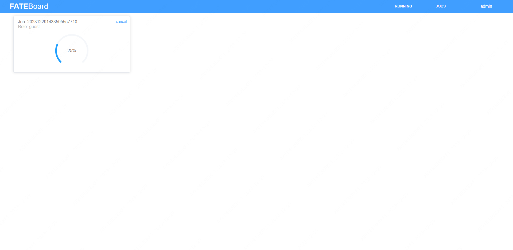

**DOC|[English](./README.md)**

FATEBoard是联邦学习建模的可视化工具，旨在帮助用户简单而高效地理解模型与探索模型。

为了便于理解、跟踪、调试和探索联邦学习建模过程，以及检查、评估和对比各种联邦学习模型。FATEBoard提供一种可视化的方式来探查模型，从而你可以更有效地调试和改善模型效果。

作为FATE内置的可视化工具，FATEBoard展示了丰富的数据可视化和模型可视化信息。在Running管理中，你可以监控所有进程中的job。在Dashboard，你可以实时跟踪算法组件运行的全过程，并跟踪日志详情。FATEBoard提供任务的管理，在job管理中，可以获得模型参数、模型运行结果，包括模型输出结果、模型数据结果、输出日志等。

 

# **使用** #

**数据库配置**

集群版本FATEBoard默认的数据库是mysql，如果你使用单机版FATEBoard，那么你需要用sqlite数据库。只要用sqlite参数更新这个文件：FATEBoard/src/main/resources/application.properties。你需要更新的参数如下：
spring.datasource.driver-Class-Name=org.sqlite.JDBC 

fateboard.datasource.jdbc-url=xxx 

fateboard.datasource.username= 

fateboard.datasource.password=

**启动FATEBoard** 

FATEBoard代码使用spring-boot框架并嵌入在tomcat容器中，默认的网络端口是8080。在启动前，需要检查机器的8080端口是否被占用，如果端口被占用，FATEBoard将会启动失败。

FATEBoard通过访问mysql数据库来获得任务列表，如果没有正确安装数据库，那么任务获取就会失败。 

FATEBoard通过HTTP协议来访问FATEFlow。如果没有正常启动FATEFlow，FATEBoard将无法呈现任务图表。

你可以通过 http://{FATEBoard-ip}:8080来访问FATEBoard。

**启动一个新的建模任务** 

1.准备条件：配置一个pipeline，创建DAG图，定义参数。
2.启动FATEBoard：提交并启动任务后，返回一个任务URL，点击URL即可在网页上访问这个任务。或者，在任务启动时，你可以通过web浏览器访问http://{FATEBoard-ip}:8080来查看FATEBoard。
host或arbiter方也可以通过http://{FATEBoard-ip}:8080访问FATEBoard。
3.监控任务：dashboard可视化了任务运行全过程。
4.查看任务：可视化查看每个算法组件的模型输出、数据输出、运行日志等。

FATEBoard适用的浏览器包括Google浏览器、IE 10.0及以上和其他主流浏览器。另外一些浏览器可能也可以，但不排除存在bug或性能问题。

# **可视化** #

**任务仪表盘** 

FATEBoard的任务仪表盘展示了任务运行过程中随时间变化，包括任务运行时间、实时更新日志、每个组件的运行状态。当你提交任务，你可能需要等待任务开始运行，此时可以查看running页面查看所有运行中的任务及等待运行的任务。

**任务可视化**

任务可视化提供了任务执行的全览，尽可能地可视化任务的结果。一些交互说明如下：

- 页面左侧展示了任务的基本信息
- 点击组件，可以查看组件参数
- 点击组件参数下方的按钮，可以查看组件的输出。通过切换标签查看模型输出、模型汇总，模型指标、数据输出和日志等

**工作流的可视化**

联邦学习建模的工作流可以帮助你更加直观地跟踪运行中的任务，对于每一方参与建模的角色，都可以查看各自在联邦建模中的图表。 

**模型图表可视化**

FATEBoard给联邦学习模型提供了丰富多样的可视化方式，包括统计表、直方图、曲线等等。你可以对比同一数据集使用不同训练模型训练的效果，或者探查一个模型的性能，从而不断地调试和训练，以上都可以很好地帮助你找到最佳的模型。

**数据的可视化**

每个组件的数据输出可以预览100行原始数据和预测数据，预测数据包括预测结果、预测分数和预测详细信息。

# **常见问题** #

**FATEBoard没有显示任何组件的数据** 

FATEBoard通过给FATE-Flow发送Http请求获得每个算法模块的输出数据。而源码中的logback.xml文件指定了该请求的日志输出，根据该日志你能轻松定位到定位2个服务之间的通讯问题，找到获取数据失败的原因。

**FATEBoard没有显示算法模块运行日志**

FATEBoard通过查询数据库展示所有的算法任务以及他们的详细信息。
在单机版中,FATEBoard查询本地日志文件，并通过websocket协议在前端展示。所以如果日志无法显示，请确认日志文件是否正常生成。
在集群版中，FATEBoard通过ssh方式读取不同机器上的日志文件，通过websocket协议推送到前端。默认的日志路径是/data/projects/fate/logs。如果日志无法展示，那么可能是ssh的连接信息错误，你可以点击页面右上角的设置按钮重新设置正确的ssh连接信息。
